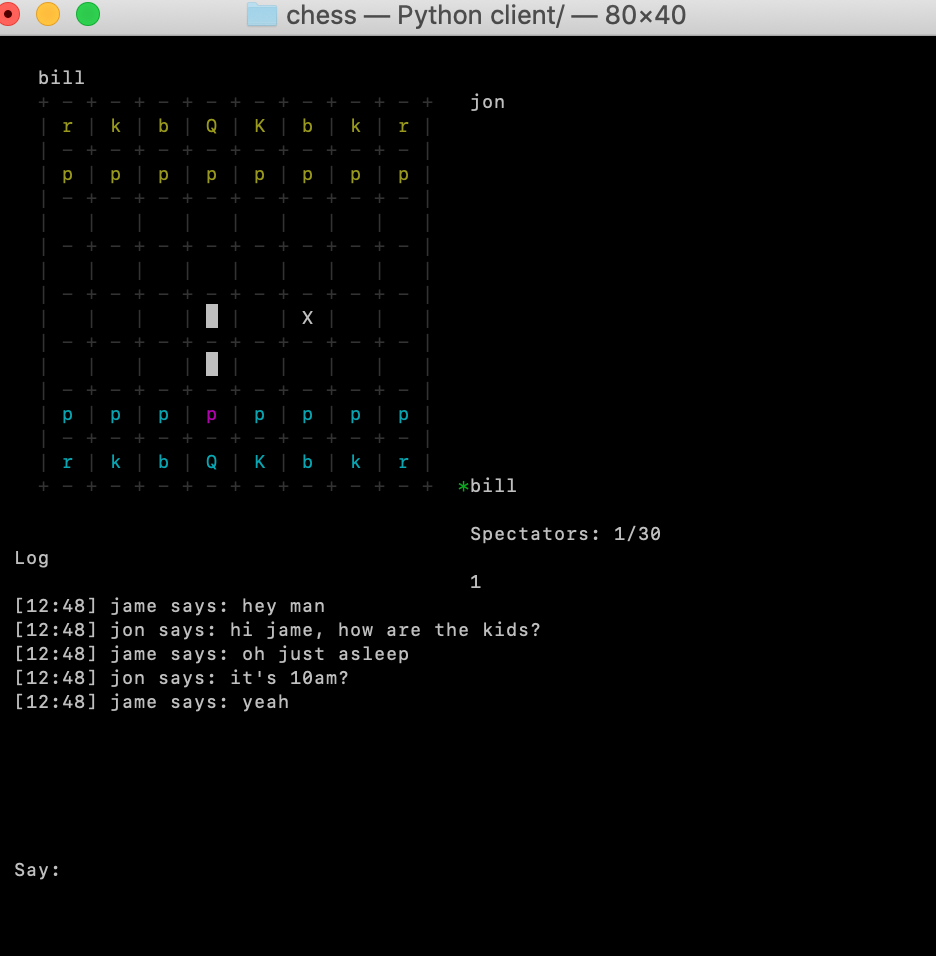
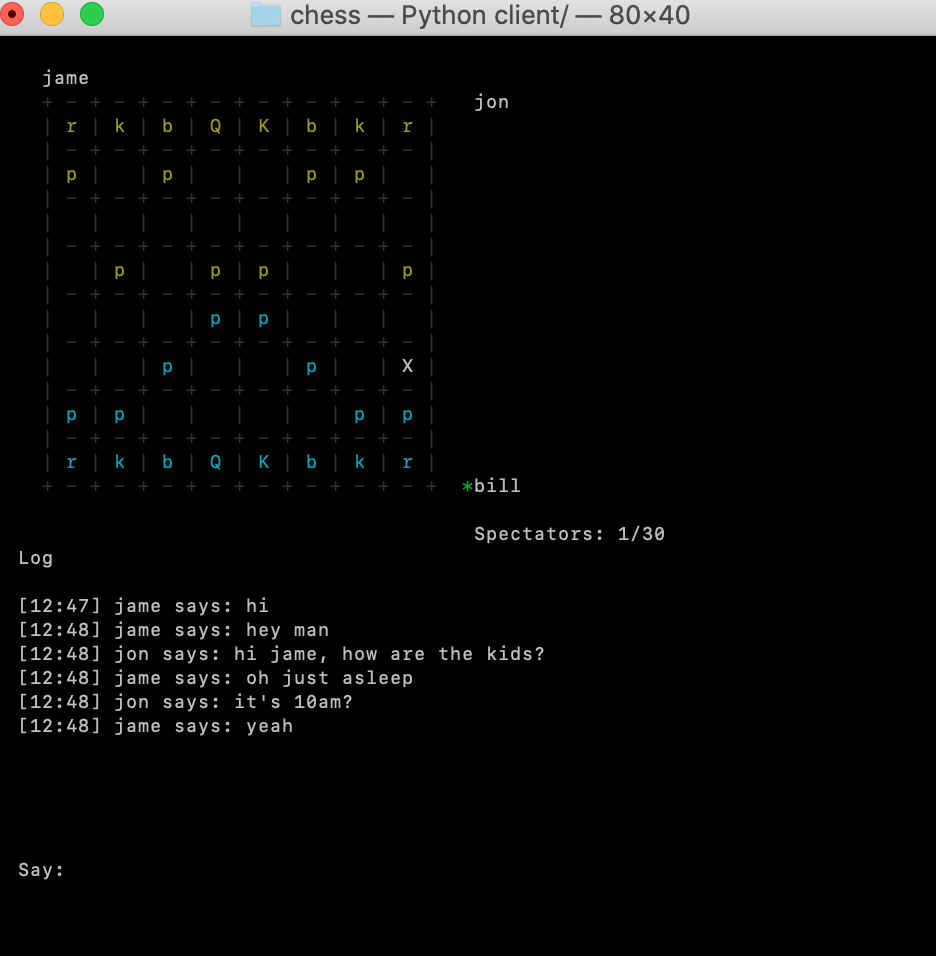

# Cursed Chess

Online multiplayer chess with up to 32 participants in each server.

### How to Play

The game is online only. It is possible to play locally or disconnected from the internet by running the server on your machine and connecting to localhost. The port is 42523 by default.

You can host the server on any machine that has python.

Just run `$ python3 server/` in the root directory to start the server, then `$ python3 client/` to start a client.

Control the cursor with the arrow keys, with [ENTER] to select pieces. Press [t] to chat to others.

The first two players to join the server will be chosen as the white and black players. Anyone who joins after the first two players will be spectators, who can all chat between each other, but cannot move any pieces.

### Screenshots

